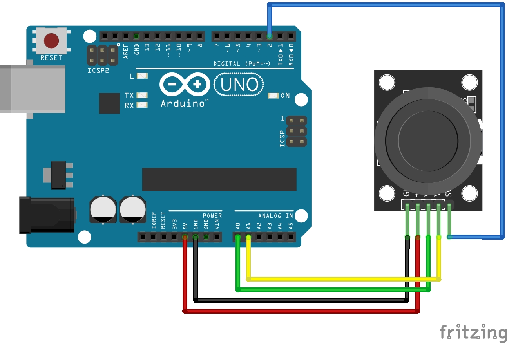

<div align="center">
   <h1>
      Who Needs A Mouse
   </h1>
   <p align="center">
      I got bored (again) so I made a <s>shitty</s> thing to control my mouse using a joystick
   </p>
   
</div>

## How it works

Using a Arduino we can read the analog input of a joystick, so I thought why not control my mouse with it.
The code is pretty basic.
We Simply read the x and y values from their corresponding pins where they are connected to.
For the button we use a library called `ezButton.h` this allows us to read the button state from the coresponding digital pin.
Because the rest position (center) of the joystick doesn't equal `x=0` and `y=0`, but `x=500` and `y=511` instead.
Therefore we need to substract these numbers from the value we read from the analog pins to get `x=0` and `y=0`.
For the button we just return `1` when the button state is `HIGH` and `0` when `LOW`, we do this by using the `isPressed()` function that will return a boolean (`true` or `flase`).

To compile and upload the code to the Arduino you can do the following.

**NOTE**: The commands below assume you are using an Arduino UNO. Refer to the [docs](https://arduino.github.io/arduino-cli/0.27/getting-started/) for more information.

```
$ cd src/                                                                     # Navigate inside the source directory
$ arduino-cli compile --fqbn arduino:avr:uno joystick                         # Compile the code
$ arduino-cli upload -p /dev/ttyACM0 --fqbn arduino:avr:uno joystick          # Upload the compiled code to the Arduino UNO
```

Now it's time to let the input from the joystick control the mouse input on the computer.
To do this we need let the computer know what the current position of the joystick is, so let't read the input from the serial monitor and figure it out from there.
Just like my other project [wittimr](https://github.com/AntonVanAssche/wittimr) (What Is The Temperature In My Room) we will read the serial output from this file `/dev/ttyACM0`.
I'm not sure but I believe it's `/dev/tty/COM1` on Windows based machines.
But first we need to update the permissions (`crw-rw-rw-`) to do so. We will have to do this everytime we disconnect and reconnect the arduino to the computer.

```bash
$ sudo chmod a+rw /dev/ttyACM0
```

To read this file we can use Python (see [`mouse.py`](./src/mouse.py) file) which then prints the coordinates out and controls the mouse input.
To control the mouse I use a library called `pyautogui` which allows us to control the input from the computer, such as the keyboard and mouse.
Since we don't want to move the mouse to a fixed coordinate, but rather to a position relative to the current one, we need to use the `moveRel` function instead of the usual `moveTo` function of the library.

```
$ pip3 install -r requirements.txt           # Install the required python packages
$ python3 mouse.py                           # Run the script
```

## Electrical scheme



## References

- [Arduino – Read Serial Communication with Raspberry Pi](https://www.elithecomputerguy.com/2020/12/arduino-read-serial-communication-with-raspberry-pi/) by Eli the Computer Guy
- [PyAutoGUI’s documentation](https://pyautogui.readthedocs.io/en/latest/quickstart.html)
- [Arduino CLI Getting started](https://arduino.github.io/arduino-cli/0.27/getting-started/)

